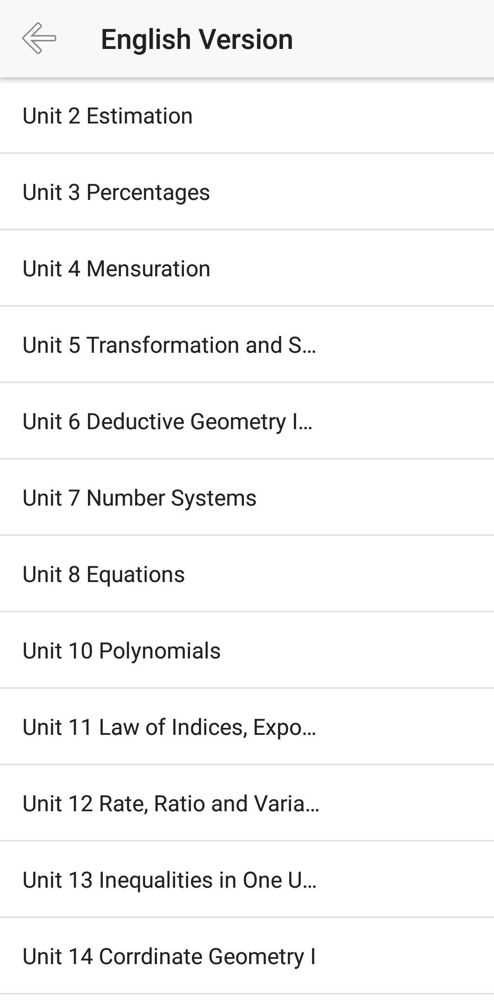
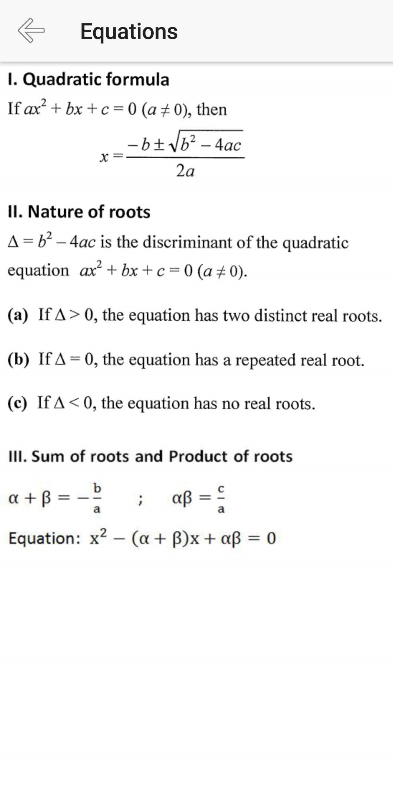
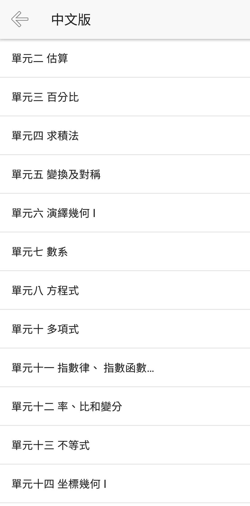
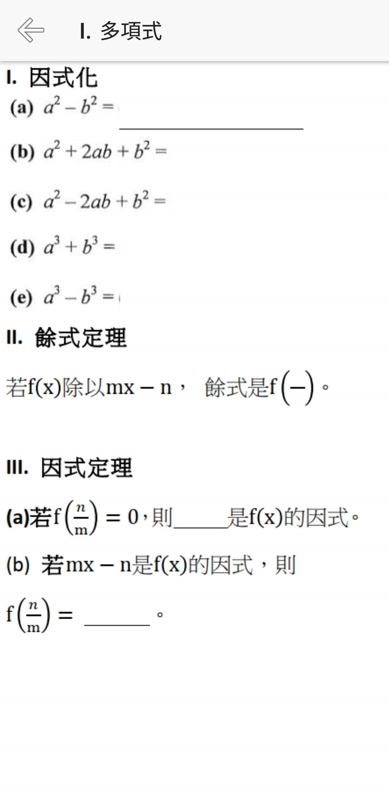

# NativeScript-Vue Application

> A native application built with NativeScript-Vue

## Usage

``` bash
# Install dependencies
npm install

# Build for production
npm run build
npm run build:<platform>

# Build, watch for changes and debug the application
npm run debug
npm run debug:<platform>

# Build, watch for changes and run the application
npm run watch
npm run watch:<platform>

# Clean the NativeScript application instance (i.e. rm -rf dist)
npm run clean
```

> When invoking the various npm scripts, omitting the platform will attempt to launch `tns` for both platforms, which will only work in a properly configured OSX environment.

For detailed instructions, see https://github.com/nativescript-vue/vue-cli-template

## App Screen Shot
<p align='center'>

</p>









